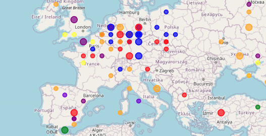
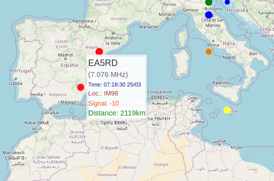

# FT8 Logs Visualization and Management System

A comprehensive web-based application for visualizing and managing FT8 amateur radio logs from web-888 devices. This application provides real-time visualization, ADIF file management, callsign tracking, and production-ready Linux service deployment.

## Key Features

- **Real-time FT8 spot visualization** on interactive world map
- **ADIF file upload to detect stations from countries not worked before**

---

## Support and Contributing

- **Issues**: Report issues on the GitHub repository
- **Documentation**: See [SERVICE_SETUP.md](SERVICE_SETUP.md) for detailed service management
- **Contributing**: Pull requests welcome for bug fixes and enhancements

## License

This project is open source. Please check the repository for license details.h worked station tracking
- **Callsign lookup caching** for improved performance
- **Worked stations tracking** (callsigns, countries, grid squares)
- **Production-ready Linux systemd service** deployment
- **Statistics and analytics** for worked stations
- **Docker support** for quick deployment
- **Integration with GridTracker 2** and WSJT-X

The latest version of web-888 [build 20250304] supports using syslog for logging FT8 data.


## Quick Installation Options

### Option 1: Docker (Recommended for Quick Setup)

If you use Docker, you can get started quickly without dealing with dependencies:

```bash
# Simple setup (visualization only)
docker run -d -p 5019:5019 -p 5140:5140/udp \
    -e LimitTime=900 \
    --name ft8-visual \
    --restart unless-stopped \
    bujdo/ft8_visualisation_syslog_web888:020325

# Full setup with ADIF logging
mkdir logs
docker run -d -p 5019:5019 -p 5140:5140/udp \
    -e LimitTime=900 \
    -e STATION_CALLSIGN=N0CALL \
    -e MY_GRIDSQUARE=AA00aa \
    -e ADIF_LOGS=Yes \
    --name ft8-visual \
    --restart unless-stopped \
    -v $(pwd)/logs:/app/logs \
    bujdo/ft8_visualisation_syslog_web888:020325
```

### Option 2: Linux Systemd Service (Production)

For production deployment with automatic startup and service management:

```bash
# Clone the repository
git clone https://github.com/gorzynsk/playWith-web888-ft8-logs.git
cd playWith-web888-ft8-logs

# Install as systemd service
chmod +x install-service.sh
sudo ./install-service.sh
```

### Option 3: Manual Development Setup

For development and testing:

```bash
# Clone repository
git clone https://github.com/gorzynsk/playWith-web888-ft8-logs.git
cd playWith-web888-ft8-logs

# Run installation script
chmod +x install.sh
./install.sh

# Activate virtual environment
source .venv/bin/activate

# Run application
python3 ft8logs.py
```

## Configuration Options

The application supports various environment variables for customization:

```bash
STATION_CALLSIGN="N0CALL"         # Your amateur radio callsign
MY_GRIDSQUARE="JO92xx"           # Your grid square location
LimitTime=1800                   # Time in seconds to keep spots visible (default: 30 minutes)
ADIF_LOGS="No"                   # Generate ADIF logs ("Yes" or "No")
DEBUG=true                       # Enable detailed debug logging
```

### Key Configuration Notes:
- **LimitTime**: Controls how long spots remain visible on the map (in seconds)
- **ADIF_LOGS**: When set to "Yes", creates WSJT-X compatible ADIF logs in `./logs/wsjtx_log.adi`
- **Debug mode**: Provides detailed console output for troubleshooting
- **Default ports**: UDP 5140 (syslog input), TCP 5019 (web interface)

## Web Interface Access

Once installed and running, access the application at:
- **Main Interface**: http://localhost:5019
- **API Endpoints**:
  - `/spots` - Current FT8 spots (JSON)
  - `/worked_stats` - Worked stations statistics
  - `/cache_stats` - Callsign lookup cache statistics
## New Features

### ADIF File Management
- **Upload Interface**: Web-based ADIF file upload at `/upload`
- **Worked Stations Tracking**: Automatically tracks worked callsigns, countries, and grid squares
- **Duplicate Detection**: Identifies previously worked stations with visual indicators
- **Statistics Dashboard**: View worked station counts and lists via `/worked_stats`

### Performance Enhancements
- **Callsign Lookup Caching**: Reduces API calls and improves response time
- **Persistent Storage**: Worked stations and cache data saved between sessions
- **Background Processing**: Non-blocking callsign lookups and data processing
- **Memory Management**: Automatic cleanup of expired spots

### Production Features
- **Linux Service Support**: Full systemd service with automatic startup
- **Security Hardening**: Dedicated user account with restricted permissions
- **Logging and Monitoring**: Comprehensive logging via journalctl
- **Graceful Shutdown**: Saves cache and worked data on exit
- **Configuration Management**: Environment-based configuration

### Visual Enhancements
- **Worked Station Indicators**: Different colors for worked vs. new stations
- **Grid Square Tracking**: Track worked grid squares separately
- **Country Tracking**: DXCC entity tracking with ADIF country codes
- **Real-time Updates**: Live map updates every 10 seconds

# Setup and Configuration

## Web-888 Syslog Configuration

### Custom Linux Setup (Non-persistent)

To run on a custom Linux setup, SSH into your device, install the rsyslog package, and create a configuration file:

```bash
# Add rsyslog to your running web-888
apk add rsyslog

# Configure syslog forwarding
vi /etc/rsyslog.conf
#### Rules ####
*.* @10.10.10.10:5140   # Forward to FT8 logs application
*.* @10.10.10.20:514    # Optional: additional destination
& ~

# Start rsyslog service
/etc/init.d/rsyslog start

# Enable FT8 syslog in web-888
# Navigate to: Extensions -> FT8 -> Log decodes to syslog [Yes]
# Restart web-888 frontend via http://IP:port/admin
```

**Important Notes:**
- Port 5140 is mandatory for the FT8 logs application
- The second IP address (10.10.10.20:514) is optional
- UDP protocol is preferred to avoid issues when the target device is offline
- Do not reboot the device as changes will be lost

### Alternative: Grafana Integration

You can create custom visualizations with Grafana using syslog data and geo-location visualization. This provides additional analytics capabilities beyond the built-in web interface.

### Restart Services

After configuration, restart the rsyslog service:

```bash
/etc/init.d/rsyslog restart
```


# Installation and Deployment

## System Requirements

- Linux system with systemd (for service deployment)
- Python 3.6 or later
- UDP port 5140 access for syslog input
- TCP port 5019 access for web interface
- Internet access for callsign lookups (optional but recommended)

## Installing the Application

The system assumes that all data and system time are in UTC. Spots are displayed for the configured time period (default: 30 minutes).

### Option 1: Manual Installation (Development)

To install for development/testing, run the following commands:
```
chmod +rx ./install.sh
./install.sh

source .venv/bin/activate
```

### Option 2: Linux Service Installation (Production - Recommended)

For production deployment as a Linux systemd service:

```bash
# Clone repository
git clone https://github.com/gorzynsk/playWith-web888-ft8-logs.git
cd playWith-web888-ft8-logs

# Make installation script executable
chmod +x install-service.sh

# Install as service (requires sudo)
sudo ./install-service.sh
```

**Service Installation Features:**
- Installs to `/opt/ft8logs` with proper permissions
- Creates dedicated system user for security
- Automatic startup on boot
- Service management via systemctl
- Comprehensive logging via journalctl

See [SERVICE_SETUP.md](SERVICE_SETUP.md) for detailed service management instructions.

## Running the Application

### Manual Start (Development)
```bash
# Standard mode
python3 ft8logs.py

# Background mode (no output)
python3 ft8logs.py >/dev/null 2>&1 &

# Debug mode (verbose output)
python3 ft8logs.py debug
```

### Service Management (Production)
```bash
# Start service
sudo systemctl start ft8logs

# Stop service
sudo systemctl stop ft8logs

# Restart service
sudo systemctl restart ft8logs

# View real-time logs
sudo journalctl -u ft8logs -f

# Check service status
sudo systemctl status ft8logs

# Enable automatic startup
sudo systemctl enable ft8logs
```


# Application Features and Usage

## Core Functionality

The application processes FT8 log data from web-888 devices via syslog (UDP port 5140) and provides:

### Real-time Visualization
- Interactive world map using OpenStreetMap
- Color-coded spots by frequency band
- Size-coded spots by age (larger = more recent)
- Hover details showing callsign, frequency, distance, signal strength

### Data Processing
- Automatic callsign lookup with country and grid square information
- Duplicate detection and "worked before" indicators
- ADIF-compatible logging format
- Persistent storage of worked stations and cache data

### Web Interface
The application serves a web interface on **port 5019** (updated from previous port 5000) with the following endpoints:

- **Main Interface**: http://server:5019/
- **API Endpoints**:
  - `/spots` - Current FT8 spots (JSON format)
  - `/worked_stats` - Statistics on worked stations
  - `/cache_stats` - Callsign lookup cache information
  - `/upload` - ADIF file upload interface

## Log Format and Processing

Example syslog entry from web-888:

```
<14>Feb 25 17:46:31 web-888 : 1d:19:22:28.183 ..2345678.... 3 L FT8 DECODE: 14075.359 CT2HEX IM58 -9 2669km Tue Feb 25 17:46:15 2025
```

**Parsed Output (JSON format via /spots endpoint):**
```json
{
  "callsign": "CT2HEX",
  "frequency": 14075.359,
  "timestamp": 1740548205,
  "coordinates": [39.0, -8.0],
  "locator": "IM58",
  "distance": "2669km",
  "signal": "-9",
  "country": "Portugal",
  "worked_before": false,
  "locator_worked_before": false,
  "country_worked_before": true
}
```

## Visual Indicators and Color Coding

### Frequency Band Colors
Spots are color-coded by frequency band for easy identification:

```
Band    Frequency (MHz)    Color
--------------------------------
80m     3                  Brown
40m     7                  Red
30m     10                 Blue
20m     14                 Orange
17m     18                 Yellow
15m     21                 Purple
10m     28                 Green
Other   Various            Random
```

### Visual Status Indicators
- **Size**: Larger spots = more recent (last ~60 seconds)
- **Worked Indicators**: Different visual treatment for previously worked stations
- **Grid Square Status**: Indication of previously worked grid squares
- **Country Status**: DXCC entity worked status

You can customize these colors in the `templates/index.html` file. The map refreshes automatically every 10 seconds with new data.




Hover over a spot to see detailed information about the callsign, frequency, distance, locator, signal strenght.

The spots contain data from the last 1800 seconds (30 minutes).




# Debugging and Troubleshooting

## Application Startup

When running in debug mode, the application provides detailed startup information:

```bash
python3 ft8logs.py debug
```

**Expected Output:**
```
--------------------------------------------------------------------
Syslog should send data to UDP port: 5140
  *** LimitTime: We show spots from last: 1800 sec
  *** Callsign lookup caching: ENABLED
--------------------------------------------------------------------
Loaded worked data: 1250 callsigns, 95 countries, 450 locators
Loaded callsign cache: 2300 entries (2180 successful, 120 failed)
 * Running on all addresses (0.0.0.0)
 * Running on http://127.0.0.1:5019
 * Running on http://10.10.1.1:5019
```

## API Testing

### Check Current Spots
```bash
curl http://localhost:5019/spots
```

### View Statistics
```bash
curl http://localhost:5019/worked_stats
curl http://localhost:5019/cache_stats
```

## Service Debugging

For systemd service issues:

```bash
# Check service status
sudo systemctl status ft8logs

# View recent logs
sudo journalctl -u ft8logs -n 50

# Follow logs in real-time
sudo journalctl -u ft8logs -f

# Check for errors
sudo journalctl -u ft8logs --priority=err
```


# Recent Updates and Features

## Version History

### August 2025 - Production Service Release
- **Linux systemd service support** with automatic installation
- **Enhanced security** with dedicated user accounts and restricted permissions
- **Service management scripts** for easy deployment and maintenance
- **Comprehensive documentation** in SERVICE_SETUP.md

### April 2025 - ADIF and Tracking Features
- **ADIF file upload and processing** via web interface
- **Worked stations tracking** with persistent storage
- **Callsign lookup caching** for improved performance
- **Statistics dashboard** showing worked countries, callsigns, and grid squares

## Current ADIF Support

The application now generates WSJT-X compatible ADIF logs:

```adif
<CALL:5>UY0CA
<GRIDSQUARE:4>KN69
<MODE:3>FT8
<RST_SENT:3>-00
<RST_RCVD:2>-8
<QSO_DATE:8>20250401
<TIME_ON:6>065315
<QSO_DATE_OFF:8>20250401
<TIME_OFF:6>065315
<BAND:4>20m
<FREQ:9>14.074709
<STATION_CALLSIGN:6>N0CALL
<MY_GRIDSQUARE:6>AA00AA
<EOR>
```

## Statistics and Analytics

The web interface now displays comprehensive statistics:

- **Top 10 Lists**:
  - Longest distance contacts
  - Highest signal strength
  - Lowest signal strength  
  - Most recently spotted stations
- **Worked Tracking**:
  - Total worked callsigns
  - DXCC countries worked
  - Grid squares worked
- **Performance Metrics**:
  - Callsign cache hit rates
  - Lookup success statistics


### Compile the latest firmware from the master, this part is not required any longer

Follow the instructions at https://github.com/RaspSDR/server to create a virtual Alpine Linux environment.


Once set up, compile the firmware using:
```
cmake --build . -j `nproc --all`
```

After compilation, copy the new .bin file from the following path to the SD card:
```
~/alpine/alpine-root/root/server/build/
```
Note: Do not delete the original file—just rename it. This way, you can revert to the original version by renaming the file back at any time.


# Integration and Third-Party Tools

## GridTracker 2 Integration

The application integrates seamlessly with GridTracker 2 for enhanced visualization:

### Installation
```bash
cd /your/logs/directory
wget https://download2.gridtracker.org/GridTracker2-2.250318.1-x86_64.AppImage
chmod +x GridTracker2-2.250318.1-x86_64.AppImage 
./GridTracker2-2.250318.1-x86_64.AppImage
```

### Configuration
1. Start GridTracker 2
2. Go to Settings → Logging
3. Click "WSJT-X log [wsjtx_log.adi]"
4. Point to your log file:
   - **Service installation**: `/opt/ft8logs/logs/wsjtx_log.adi`
   - **Docker installation**: `./logs/wsjtx_log.adi`
   - **Manual installation**: `./logs/wsjtx_log.adi`

GridTracker 2 will automatically visualize all records stored in the ADIF file, providing additional mapping and statistics features.


**Resources:**
- [GridTracker Downloads](https://gridtracker.org/index.php/downloads/gridtracker-downloads)
- [GridTracker Wiki](https://gitlab.com/gridtracker.org/gridtracker/-/wikis/home)

## Service Management

For production deployments using the systemd service:

### Daily Operations
```bash
# Check service health
sudo systemctl status ft8logs

# Restart if needed
sudo systemctl restart ft8logs

# Monitor logs
sudo journalctl -u ft8logs -f --since "1 hour ago"
```

### Backup Important Data
```bash
# Backup logs and cache (for service installation)
sudo cp -r /opt/ft8logs/logs /backup/location/

# Manual backup command can be added to cron
0 2 * * * cp -r /opt/ft8logs/logs /backup/ft8logs-$(date +\%Y\%m\%d)
```

### Updates and Maintenance
```bash
# Stop service for updates
sudo systemctl stop ft8logs

# Update application files
sudo cp ft8logs.py /opt/ft8logs/
sudo cp -r templates/* /opt/ft8logs/templates/

# Restart service
sudo systemctl start ft8logs
```

## Uninstallation

To remove the service installation:

```bash
chmod +x uninstall-service.sh
sudo ./uninstall-service.sh
```

This will:
- Stop and disable the service
- Backup log files to `/tmp/ft8logs-backup-[timestamp]/`
- Remove installation files and service user
- Clean up systemd configuration
