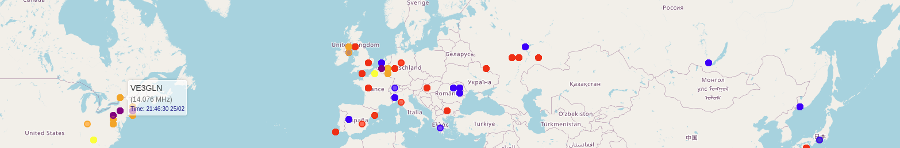

Note: This is an alpha release. The current code is not as polished as I'd like it to be. It's mainly a proof of concept at the moment.

# Visialization of FT8 logs from web-888

The latest version of web-888 now supports using syslog for logging FT8 data. You can either compile the software yourself or wait until it's included in the general firmware update.


## Quick install of application which show ft8 data on map of the world

If you use docker, then it all can be done quick without dealing with dependency.
```
docker run -d -p 5000:5000 -p 5140:5140/udp  -e LimitTime=900 --name ft8-visual --restart unless-stopped bujdo/ft8_visualisation_syslog_web888:020325

// and check it is running

docker ps |grep ft8
```


There is an option to specify environemnt variables
```
DEBUG=true
LimitTime=1800
```

The debug mode will generate detailed logs, while the LimitTime variable will limit the displayed spot results to the specified number of seconds. Any spots older than the value set in LimitTime will be removed. Standard = 1800 sec = 30 minutes.


App will be accessible on http://localhost:5000, you have now to
continue on rsyslog support.


# Temporary add rsyslog

### Compile the latest firmware from the master
Follow the instructions at https://github.com/RaspSDR/server to create a virtual Alpine Linux environment.


Once set up, compile the firmware using:
```
cmake --build . -j `nproc --all`
```

After compilation, copy the new .bin file from the following path to the SD card:
```
~/alpine/alpine-root/root/server/build/
```
Note: Do not delete the original file—just rename it. This way, you can revert to the original version by renaming the file back at any time.


### Custom running linux - Not boot pesistent

To run on a custom Linux setup, SSH into your device, install the rsyslog package, and create a configuration file:

```
apk-add rsyslog


vi /etc/rsyslog.conf
#### Rules ####
*.* @10.10.10.10:5140
*.* @10.10.10.20:514
& ~
```

This configuration sends logs to two IP addresses: 10.10.10.10:5140 and 10.10.10.20:514. The second IP is simply for demonstration, showing that multiple IPs can be used. For my project, port 5140 is mandatory.

You can create custom visualizations with Grafana using syslog data and geo-location visualization. I prefer using UDP since it doesn't cause issues when the target device is offline.

Restart the service once configured:

```
/etc/init.d/rsyslog restart
```


## Installing the Application

The system assumes that all data and system time are in UTC. Only the last 1800 seconds (30 minutes) of data will be displayed.

To install, run the following commands:
```
chmod +rx ./install.sh
./install.sh

source .venv/bin/activate
```


## Start the app
```
#Without debugging to screen
python3  app.py 
python3  app.py >/dev/null

#with debug to screen
python3  app.py debug
```


# Inside the application

For proper functionality, the application requires that UDP port 5140 be used to receive syslog logs from the web-888 device. The new log format no longer includes "PSKReporter spot."

Example log entry:

```
Tue Feb 25 17:46:31 1d:19:22:28.183 ..2345678....    3          L FT8 DECODE: 14075.359 CT2HEX IM58 -9 2669km Tue Feb 25 17:46:15 2025
```

The application parses the logs and provides results via the following URL: http://server:5000/spots. The visualization is done through http://server:5000/, which serves a JavaScript-based page that refreshes every 10 seconds to request new JSON-like content from /spots.

The world map uses OpenStreetMap for visualization, with each spot represented by a dot.


Spots on the same frequency share the same color:
```
          Mhz:  'Colour'
          ----------------
            3: 'brown',
            7: 'red',
            10: 'blue',
            14: 'orange',
            18: 'yellow',
            21: 'purple',
            28: 'green'
```
You can further customize these colors in the index.html file. Any frequency that is not defined will be assigned a random color. The callsigns received in the last ~60 seconds are displayed larger, while older ones appear smaller.


Hover over a spot to see detailed information about the callsign, frequency, distance, locator, signal strenght.

The spots contain data from the last 1800 seconds (30 minutes).


# Debug


## Starting app

The application listens on UDP port 5140 (syslog) and TCP port 5000 (web frontend).
```
 python3  app.py debug 

 Syslog should send data to UDP port: 5140
 * Running on all addresses (0.0.0.0)
 * Running on http://127.0.0.1:5000
 * Running on http://10.10.1.1:5000
```


## Processing  syslog


```
// data from syslog
Raw input: <14>Feb 25 19:52:16 web-888 : 1d:21:28:13.177 ..2345678....       6       FT8 DECODE: 24916.878 VE2WNF FN35 -11 6640km Tue Feb 25 19:52:00 2025


//parsed data from syslog export in json like
New spot added: {'callsign': 'VE2WNF', 'frequency': 24916.878, 'timestamp': 1740513120, 'coordinates': [45.0, -74.0], 'humantime': datetime.datetime(2025, 2, 25, 19, 52, tzinfo=<UTC>)}
```


## Check spots in linux command line
```
curl http://10.10.1.1:5000/spots
```

Expected output format like:
```
[{"callsign":"TF1EIN","coordinates":[64.0,-22.0],"frequency":21075.6,"timestamp":1740513555},{"callsign":"EA8DHH","coordinates":[28.0,-18.0],"frequency":21076.022,"timestamp":1740513555},{"callsign":"SV1JRR","coordinates":[37.0,22.0],"frequency":14074.497,"timestamp":1740513555},{"callsign":"DL6FKK","coordinates":[52.0,12.0],"frequency":7074.503,"timestamp":1740513555},{"callsign":"VA3JSF","coordinates":[44.0,-76.0],"frequency":14075.572,"timestamp":1740513555}]
```


# Latest news

Now the page also displays statistic of:
```
Top 10
---------------------------------------------
Long distance callsign
High signal   callsign
Low  signal   callsign
Last spoted   callsign
```


