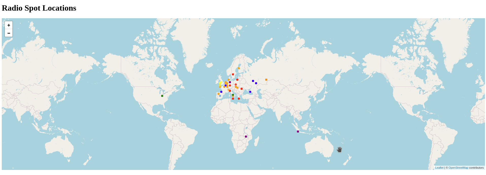

Note: The current version is just alfa release. And current code is not so nice as I would wish :). This was just for prove of concept.

# Visialization of FT8 logs from web-888

The new version of web-888 allow to use syslog for logging of ft-8 data.
You have to compile sw on your own or wait till is in general firmware app.


## Temporary add rsyslog

### Compile the latest firmware from the master
Follow up https://github.com/RaspSDR/server to create virtual Alpine linux environment.

Then on the end compile using:
```
cmake --build . -j `nproc --all`
```

Copy the new *.bin file from path bellow to sd card. 
Ps: do not remove original file, just rename it.
So you can come back with rename any time.

```
~/alpine/alpine-root/root/server/build/
```


### Custom running linux - Not boot pesistent

Login using ssh to device and add rsyslog package and create config file.

```
apk-add rsyslog


vi /etc/rsyslog.conf
#### Rules ####
*.* @10.10.10.10:5140
*.* @10.10.10.20:514
& ~
```

The config will send rsyslog output to 2 Ip address .10 and .20. The second IP is just to show, 
that you can log to multiple IP address. For my project port 5140 is mandatory.
But you can create own vizualization with grafana using syslog and geo vizualization.
I prefere to use UDP, since it has no side effects when target device is down.

Restart the service once configured:
```
/etc/init.d/rsyslog restart
```


## Install app

For processing we asume that all the data and system time in UTC.
Just last 1800sec of data will be displayed.

```
chmod +rx ./install.sh
./install.sh

source .venv/bin/activate
```


## Start the app
```
#without debug to screen
python3  app.py 
python3  app.py >/dev/null

#with debug to screen
python3  app.py debug
```


# Inside the application

For proper function application requires port 5140 on which it receives udp rsyslog logs from web-888.
The new format does not use "PSKReporter spot" in logs any longer

```
Tue Feb 25 17:46:31 1d:19:22:28.183 ..2345678....    3          L FT8 DECODE: 14075.359 CT2HEX IM58 -9 2669km Tue Feb 25 17:46:15 2025
```

The program itself parse log in some way and provides result on same  http://server:5000/spots vizualization is done using
http://server:5000/ . Which will provides javascript page, which every 10 seconds ask for new json like content from /spots.

The map of the world, it is using openstreet map for vizaulaization. And each spot is represent as dot.


Spots from same frequency have same color:
```
          Mhz:  'Colour'
          ----------------
            3: 'brown',
            7: 'red',
            10: 'blue',
            14: 'orange',
            18: 'yellow',
            21: 'purple',
            28: 'green'
```
It could be further customized in index.html.
When there is used som not defined frequency, then random colour is in use.


When you hold the mouse button over the dot, it will show details with callsing and frequency.

Spots contains data from last 1800sec = 30 minutes.


# Debug


## Starting app
```
 python3  app.py debug 

 Syslog should send data to UDP port: 5140
 * Running on all addresses (0.0.0.0)
 * Running on http://127.0.0.1:5000
 * Running on http://10.10.1.1:5000
```

Application should listen on ports 5140/udp and 5000/tcp.


## Processing  syslog


```
// data from syslog
Raw input: <14>Feb 25 19:52:16 web-888 : 1d:21:28:13.177 ..2345678....       6       FT8 DECODE: 24916.878 VE2WNF FN35 -11 6640km Tue Feb 25 19:52:00 2025


//parsed data from syslog export in json like
New spot added: {'callsign': 'VE2WNF', 'frequency': 24916.878, 'timestamp': 1740513120, 'coordinates': [45.0, -74.0], 'humantime': datetime.datetime(2025, 2, 25, 19, 52, tzinfo=<UTC>)}
```


## Check spots in linux command line
```
curl http://10.10.1.1:5000/spots
```

Expected output format like:
```
[{"callsign":"TF1EIN","coordinates":[64.0,-22.0],"frequency":21075.6,"timestamp":1740513555},{"callsign":"EA8DHH","coordinates":[28.0,-18.0],"frequency":21076.022,"timestamp":1740513555},{"callsign":"SV1JRR","coordinates":[37.0,22.0],"frequency":14074.497,"timestamp":1740513555},{"callsign":"DL6FKK","coordinates":[52.0,12.0],"frequency":7074.503,"timestamp":1740513555},{"callsign":"VA3JSF","coordinates":[44.0,-76.0],"frequency":14075.572,"timestamp":1740513555}]
```